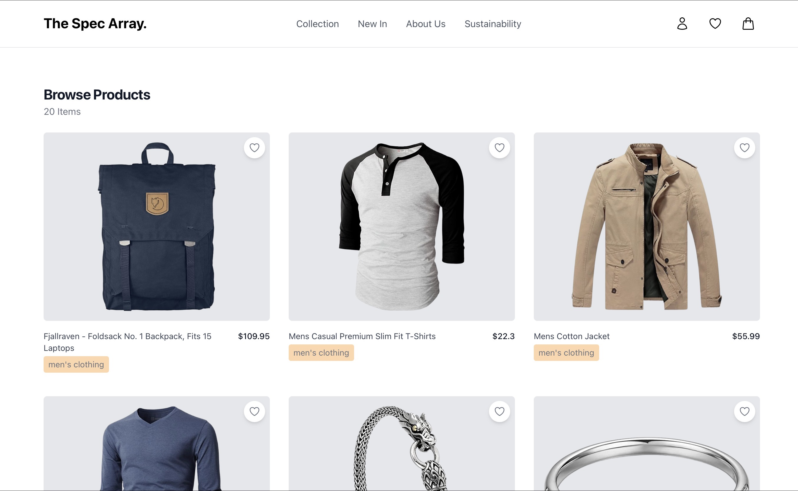

# The Spec Array ✨

A responsive e-commerce product browsing page built for the Young Developer Power (YDP) mini-project. This project showcases a clean and modern user interface for viewing products, built with React and styled with Tailwind CSS.



## 🚀 Features

- **View All Products**: Fetches and displays a list of products from a live external API.
- **Product Details Page**: Users can click on any product to navigate to a dedicated page with more detailed information.
- **Fully Responsive Design**: The layout seamlessly adapts to both desktop and mobile screen sizes.
- **Clean & Modern UI**: A minimalist design approach for a better user experience.

---

## 💻 Tech Stack

- **Core Framework**: React (bootstrapped with Vite)
- **Styling**: Tailwind CSS
- **Client-Side Routing**: React Router DOM
- **API Communication**: Axios
- **API Source**: [Fake Store API](https://fakestoreapi.com/)

---

## 🛠️ Getting Started

To get a local copy up and running, follow these simple steps.

### Prerequisites

Make sure you have Node.js and npm installed on your machine.

- You can download Node.js here: [https://nodejs.org/](https://nodejs.org/)

### Installation & Setup

1.  **Clone the repository**
    ```sh
    git clone https://github.com/MonKla/The-Spec-Array.git
    ```
2.  **Navigate to the project directory**
    ```sh
    cd Ydp
    ```
3.  **Install NPM packages**
    ```sh
    npm install
    ```
4.  **Run the development server**
    ```sh
    npm run dev
    ```
5.  **Open the app in your browser** at `http://localhost:5173` (or the address shown in your terminal).
